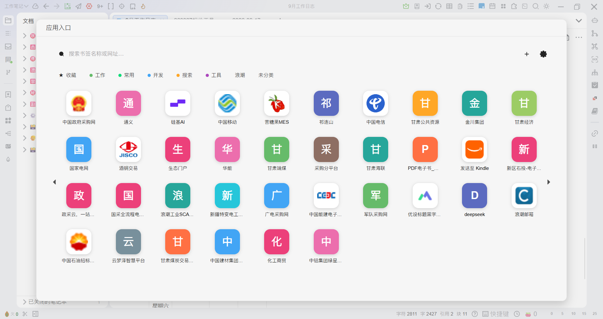
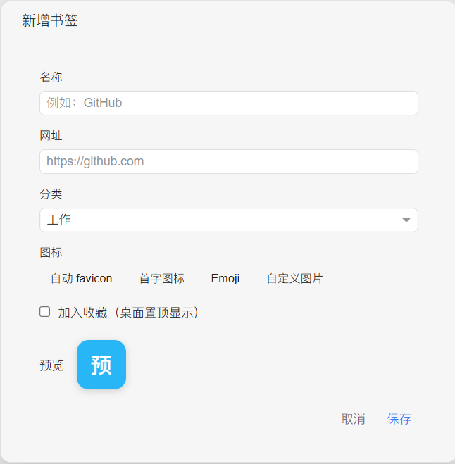
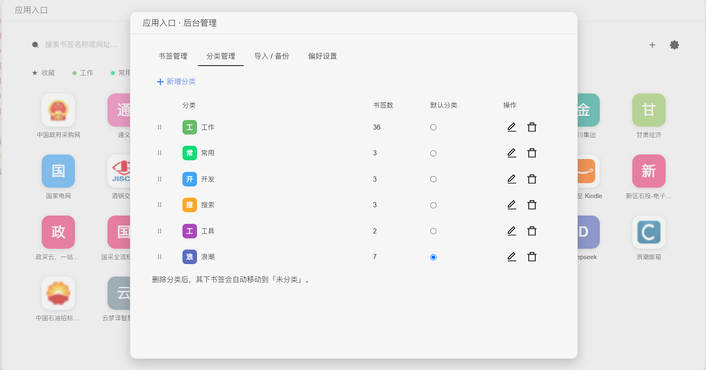
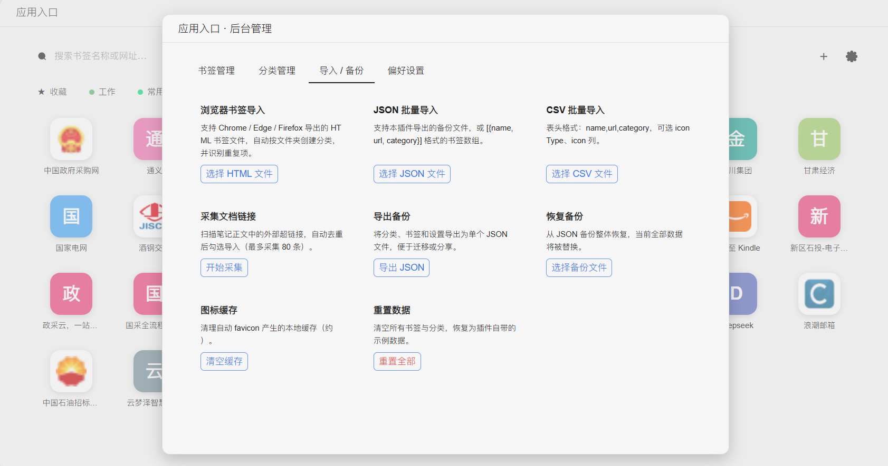
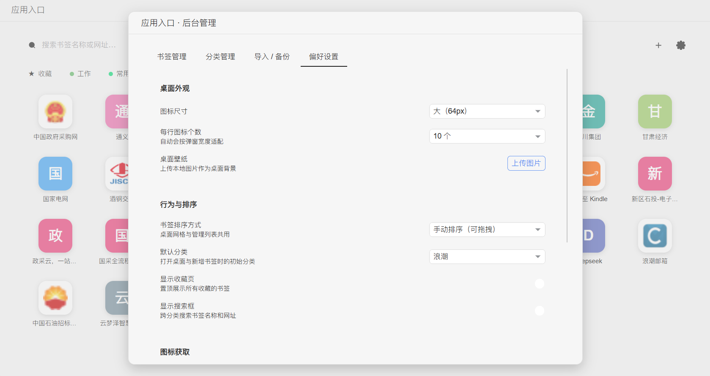

# 统一应用门户

> 把你的常用网站书签变成思源笔记里的「安卓桌面」——圆角图标网格，一键直达，分类管理，后台维护。

## 这是什么

统一应用门户是一个思源笔记插件，把浏览器书签的概念搬进笔记里。不像普通的书签管理器只是一行行链接列表，它用**安卓手机桌面风格**的圆角图标网格展示你的入口，视觉直观、触达高效。点击图标即在新标签页打开对应网站，支持分类、搜索、收藏、拖拽排序、壁纸、访问统计等完整功能。

## 核心价值

### 为什么把它放进思源笔记？

| 场景 | 没有统一应用门户 | 有了统一应用门户 |
|------|----------------|-----------------|
| 每天打开 GitHub、邮箱、文档站 | 浏览器书签栏 / 收藏夹 / 记忆网址 | 思源顶栏一键弹出，图标直达 |
| 团队/项目常用工具站散落各处 | 各自收藏、难以共享 | 导出 JSON 分发给同事，一键导入 |
| 换电脑/换浏览器 | 书签迁移繁琐 | 笔记工作空间在哪，入口就在哪 |
| 想从笔记正文里收集链接 | 手动复制粘贴 | 一键采集文档中所有外链 |
| 常用站太多记不住 | 地址栏猜网址 | 分类网格 + 搜索，3 秒找到入口 |

### 三大便利

1. **视觉化触达**：图标比文字列表识别快 3-5 倍，圆角网格比书签栏信息密度更高
2. **零迁移成本**：数据跟着思源工作空间走，换设备不丢入口
3. **一站式管理**：增删改查、导入导出、批量采集、外观定制全在笔记内完成

## 效果预览

### 安卓风格桌面弹窗

点击顶栏图标，弹出 92% 宽的大弹窗：搜索框、分类胶囊、圆角图标网格，一目了然。 favicon 加载失败自动降级为彩色首字，主题自适应明暗模式。

<div align="center">



</div>

### 新增书签

名称、网址（自动补 https）、分类下拉，4 种图标类型实时预览：自动 favicon / 首字 / Emoji / 自定义图片。

<div align="center">



</div>

### 后台管理 · 分类管理

表格视图展示所有分类：名称、图标、书签数，支持拖拽排序、设为默认、编辑配色。

<div align="center">



</div>

### 后台管理 · 导入 / 备份

8 张功能卡片：浏览器书签 HTML、JSON、CSV 导入，文档链接采集，全量导出 / 恢复，清缓存，重置。

<div align="center">



</div>

### 后台管理 · 偏好设置

图标尺寸、列数、壁纸、排序方式、favicon 服务……外观与行为自由定制。

<div align="center">



</div>

## 功能全景

### 桌面弹窗（主界面）

- **安卓风格图标网格**：圆角图标 + 名称文字，列数自适应或手动指定
- **分类胶囊页签**：收藏 / 常用 / 开发 / 搜索 / 工具……左右滑动切换，底部圆点指示
- **实时搜索**：输入关键词即时过滤书签（匹配名称 + 域名）
- **收藏页**：高频入口置顶收藏，一秒到达
- **自定义壁纸**：上传图片做桌面背景，浓度可调
- **悬停提示**：鼠标停 1 秒，深色气泡显示完整名称 + 网址
- **右键菜单**：打开网站 / 复制网址 / 收藏 / 移动到分类 / 编辑 / 删除
- **拖拽排序**：手动模式下按住图标拖动自由排列
- **点击统计**：记录每个入口的访问次数和最近访问时间

### 图标系统

- **自动 favicon**：依次尝试 favicon 服务 → 网站根 favicon.ico，加载失败显示彩色首字
- **彩色首字兜底**：基于域名哈希的 Material Design 16 色，每个站点颜色稳定
- **Emoji 图标**：用 emoji 代替网站图标
- **自定义图片**：上传任意图片作为图标
- **图标缓存**：跨域 Image + Canvas 本地缓存，减少重复请求

### 后台管理（齿轮按钮）

四个标签页覆盖全部维护需求：

**① 书签管理**
- 表格视图：名称 / 分类 / 星标 / 点击数 / 最近访问
- 搜索 + 分类筛选
- 行内快速移动分类（下拉选择）
- 行拖拽排序
- 星标收藏切换
- 新增 / 编辑 / 删除书签

**② 分类管理**
- 拖拽排序分类
- 设置默认分类
- 编辑分类名称 / Emoji / 配色
- 删除分类（书签自动归入未分类）

**③ 导入 / 备份**
- **浏览器书签导入**（HTML / Netscape 格式，自动识别文件夹为分类）
- **JSON 批量导入**（兼容备份文件 / 数组 / 单对象）
- **CSV 批量导入**（name,url,category 三列）
- **采集文档链接**：扫描当前工作空间文档正文中的所有外链，自动去重导入
- **导出备份**：全量 JSON 备份
- **恢复备份**：从 JSON 文件恢复
- **清除图标缓存**：释放 localStorage 空间
- **重置数据**：恢复出厂默认书签

**④ 偏好设置**
- 图标尺寸：48 / 56 / 64 / 72 px
- 网格列数：自适应 或 5-10 列
- 壁纸上传 + 浓度滑块
- 排序方式：手动 / 按点击数 / 按最近访问
- 默认分类设置
- 收藏页 / 搜索框开关
- favicon 服务选择（直读 / Google / DuckDuckGo / 自定义模板）
- 数据存储信息一览

### 命令面板

支持思源命令面板（`Ctrl+P`）快速调用：
- **打开统一应用门户**：直接弹出桌面
- **管理统一应用门户书签**：直接打开后台管理

## 快速上手

1. 在思源集市安装 `统一应用门户`，启用插件
2. 顶栏出现 2×2 白色小方块图标，点击弹出桌面
3. 首次自带 4 个分类、12 个示例书签，可直接使用或替换
4. 点击齿轮进入后台管理，导入你自己的浏览器书签：
   - Chrome / Edge：`书签管理器 → 右上角菜单 → 导出书签` 得到 HTML 文件
   - 在「导入 / 备份」标签页选择「浏览器书签导入」，上传 HTML 即可

## 安装方式

### 从集市安装

在思源笔记的「集市 → 挂件」中搜索 `统一应用门户`，点击安装并启用。

### 手动安装

1. 下载最新 Release 的 `siyuan-app-portal.zip`
2. 解压到思源工作空间的 `data/plugins/siyuan-app-portal/` 目录
3. 重启思源，在「设置 → 集市 → 已安装」中启用插件

## 技术栈

- **构建工具**：Vite 5
- **前端框架**：Vue 3
- **样式方案**：纯 CSS，基于思源 `--b3-theme-*` CSS 变量自动跟随明暗主题
- **数据存储**：思源 `Plugin.loadData / saveData`，持久化到工作空间
- **图标兜底**：多级降级 + Canvas 跨域缓存

## 技术特性

- **零外部依赖**：不引入任何第三方运行时库，体积小、加载快
- **主题自适应**：全部颜色基于思源 CSS 变量，明暗主题无缝切换
- **响应式布局**：移动端宽度自动单列适配
- **单例防抖**：弹窗防重复打开，数据保存防抖 400ms
- **CJS 格式**：兼容思源插件加载器标准

## 数据说明

- 所有数据存储在思源工作空间内，跟随工作空间同步
- 不上传任何数据到第三方服务器
- favicon 请求仅用于获取网站图标，不携带用户信息
- 可随时在「偏好设置」中导出 / 清除全部数据

## 开发者

```bash
# 克隆仓库
git clone <repo-url>
cd siyuan-app-portal

# 安装依赖
pnpm install

# 开发模式（watch 构建并自动输出到思源插件目录）
pnpm dev

# 生产构建
pnpm build

# 同步产物到思源工作空间
pnpm sync
```

在项目根目录创建 `.env.local`：

```
VITE_SIYUAN_WORKSPACE_PATH=D:/你的思源工作空间路径
```

## 路线图

- [ ] 云端书签同步
- [ ] 自定义图标主题包
- [ ] 书签分组嵌套
- [ ] 键盘快捷导航
- [ ] 访问热力图可视化

## 许可证

MIT License

## 反馈与建议

- 提 Issue / PR 欢迎来玩
- 使用问题、功能建议、bug 报告均欢迎

## 赞助

如果这个插件对你有帮助，欢迎一杯咖啡鼓励继续开发 ☕

<div align="center">


</div>

感谢你的支持 ❤️
